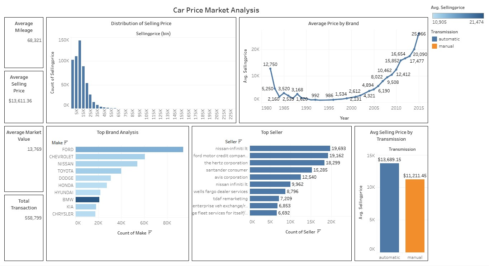

# Car Price Market Analysis

## Project Overview
This project analyzes factors that influence used car selling prices using a real-world automotive transaction dataset. The objective is to explore how variables such as vehicle age, mileage, brand, transmission type, and market benchmark values affect the final selling price, and to build a predictive model that estimates market value based on vehicle attributes.

The analysis covers the full data science workflow — from data preparation and exploratory data analysis to predictive modeling using **Linear Regression**.

## Problem Statement
Accurately pricing a used vehicle is one of the most challenging aspects of the automotive retail business. Dealers who price too high risk slow inventory turnover; dealers who price too low leave profit on the table. For buyers, understanding price drivers helps them assess whether an offer is fair or inflated.

**Key Questions Addressed:**
- What is the distribution of car selling prices in the dataset?
- Which car brands dominate the used car market?
- How do vehicle age and mileage influence selling price?
- Which sellers have the highest transaction volume?
- How strongly does the Manheim Market Report (MMR) value correlate with the final selling price?
- How does transmission type affect average selling price?

## Tools & Technologies
The following tools and technologies were used in this project:

- **Python** → Data processing and analysis
- **Pandas** → Data cleaning, transformation, and analysis
- **NumPy** → Numerical computation
- **Matplotlib / Seaborn** → Data visualization
- **Scikit-learn** → Linear Regression modeling and evaluation
- **SciPy / Statsmodels** → Statistical analysis

## Dataset

The dataset used is **`car_prices.csv`**, which contains records of used car transactions. Each row represents a single vehicle sale.

| Column | Description |
|---|---|
| `year` | Manufacturing year of the vehicle |
| `make` | Car brand (e.g., Ford, Toyota, BMW) |
| `model` | Car model name |
| `trim` | Trim level or variant |
| `body` | Body style (e.g., SUV, Sedan, Coupe) |
| `transmission` | Transmission type (Automatic or Manual) |
| `vin` | Vehicle Identification Number |
| `state` | U.S. state where the vehicle was sold |
| `condition` | Vehicle condition rating |
| `odometer` | Total mileage of the vehicle (in miles) |
| `color` | Exterior color |
| `interior` | Interior color |
| `seller` | Name of the seller |
| `mmr` | Manheim Market Report value — estimated wholesale market price (USD) |
| `sellingprice` | Final transaction/selling price (USD) |
| `saledate` | Date of the sale |

> **Note:** The MMR value is the primary market benchmark used by automotive wholesale dealers in the United States.

## Project Workflow
The project was conducted through the following stages:

1. **Data Preparation**

All required libraries were imported and the dataset was loaded. An initial inspection was performed to understand the structure and quality of the data — including shape, data types, missing values, unique value counts, and duplicates.

2. **Data Cleaning**

The dataset was cleaned by imputing missing values (mode for categorical columns, median/mean for numerical columns), parsing the `saledate` column into a proper datetime format, and standardizing brand and model names to uppercase.

3. **Exploratory Data Analysis (EDA)**

EDA was conducted to explore and understand pricing patterns through six analyses: price distribution, top brands by transaction volume, average price by model year, top sellers, correlation analysis, and transmission type comparison.

4. **Predictive Modeling**

A **Linear Regression** model was trained using five features (MMR, odometer, year, condition, and transmission type) to predict vehicle selling price. The model was evaluated using R² Score and Mean Absolute Error (MAE).

5. **Data Export**

The cleaned dataset was exported as `car_prices_clean.csv` for future use.

## Exploratory Data Analysis

Several analyses were conducted to understand the dataset:

- **Price Distribution**

The selling price distribution is right-skewed, with the majority of vehicles priced below **$50,000**. The presence of high-value outliers (luxury and specialty vehicles) pulls the mean above the median.

- **Top Car Brands**

**Ford** leads by transaction volume, followed by **Chevrolet**, reflecting strong availability and demand for American mass-market vehicles. Luxury brands represent a smaller share of transactions.

- **Average Price by Model Year**

A sharp upward price trend is evident for vehicles manufactured after 2005, confirming that model year is a key pricing variable. Older vehicles (pre-1990) show significantly lower average prices.

- **Top Sellers**

Manufacturer-affiliated financial entities such as **Nissan-Infinity LT** and **Ford Motor Credit Company LLC** dominate by transaction volume, alongside fleet/rental companies like **The Hertz Corporation**.

- **Correlation Analysis**

| Feature | Correlation with Price | Interpretation |
|---|---|---|
| **MMR** | ~0.98 (very strong positive) | The strongest predictor — wholesale market benchmark closely mirrors final price |
| **Year** | ~0.64 (moderate positive) | Newer vehicles command higher prices |
| **Odometer** | ~−0.61 (moderate negative) | Higher mileage significantly reduces selling price |
| **Condition** | ~0.30 (weak positive) | Better condition ratings are associated with slightly higher prices |

- **Transmission Type**

Vehicles with **automatic transmission** sell at a higher average price than manual transmission vehicles, reflecting consumer preference and market segmentation in the U.S.

## Predictive Modeling Results

A Linear Regression model was trained using an 80/20 train-test split. The features used were:

| Feature | Type | Rationale |
|---|---|---|
| `mmr` | Numerical | Strongest correlate with selling price |
| `odometer` | Numerical | Significant negative predictor |
| `year` | Numerical | Proxy for vehicle age |
| `condition` | Numerical | Condition rating influences value |
| `transmission` | Categorical (encoded) | Transmission type premium |

Model performance was evaluated using **R² Score** and **Mean Absolute Error (MAE)**. Residual analysis confirmed that predictions closely align with actual values across the price range.

## Dashboard Preview


## Tableau Dashboard
The interactive dashboard can be explored here:

**Tableau Public Link**
[Dashboard](https://public.tableau.com/views/CarPrice_17786627524870/Dashboard1?:language=en-US&publish=yes&:sid=&:redirect=auth&:display_count=n&:origin=viz_share_link)

## Conclusion

1. Most used car transactions occur below **$50,000**, indicating a market dominated by affordable, everyday vehicles.
2. **MMR value** is the strongest predictor of selling price (r ≈ 0.98) and should serve as the primary pricing anchor.
3. **Model year** and **odometer reading** are the next most influential factors — newer and lower-mileage vehicles command higher prices.
4. **Automatic transmission** vehicles sell at a premium compared to manual equivalents.
5. Manufacturer-affiliated financial entities and fleet companies are the primary suppliers of used vehicles in the wholesale market.

## Recommendations

**For Car Dealers:**
- Use the **MMR value as the primary pricing anchor** and adjust based on condition, mileage, and local demand.
- Stock newer model years (post-2010) to capture the price premium associated with newer vehicles.
- Prioritize **automatic transmission** vehicle acquisitions to maximize revenue per unit.

**For Buyers:**
- Consider **manual transmission** vehicles if budget is a constraint — they typically sell below the automatic equivalent.
- Focus on vehicles with **lower odometer readings** relative to their model year to maximize value retention.
- Benchmark any listed price against the **MMR value** to assess fairness.

**For Further Analysis:**
- Incorporate **geographic data** (state) to understand regional price variation.
- Explore **ensemble models** (Random Forest, Gradient Boosting) to improve prediction accuracy.
- Apply **time-series analysis** on `saledate` to detect seasonal pricing trends.

## Repository Structure
```
car-price-analysis
├── P2_Adhi-Rizqi.ipynb          # Main Notebook (data preparation, EDA, modeling)
├── car_prices.csv               # Raw dataset
├── car_prices_clean.csv         # Cleaned and processed dataset (output)
└── README.md                    # Project documentation
```

## How to Use
1. Clone this repository.
2. Install the required libraries:
   ```
   pip install pandas numpy matplotlib seaborn scikit-learn scipy statsmodels
   ```
3. Place `car_prices.csv` in the same directory as the notebook.
4. Run the `P2_Adhi-Rizqi.ipynb` notebook from top to bottom.

## Contact
For questions or collaboration, please contact Adhi Rizqi Alfaqih via [LinkedIn](https://www.linkedin.com/in/adhirizqi/) or GitHub.
